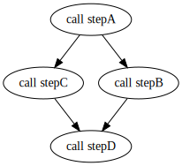

## 1. WDL

WDL全称是Workflow Description Language，是Broad Institute开发的'定义组织任务与工作流的一种语言，主要面向生物信息、基因组学等领域。


WDL有6个基本元件：
- `task`：定义一个任务，即读取输入文件，执行相应命令，然后输出
- `command`：对应task所需执行的linux命令行
- `output`：用于指定task/workflow的输出文件/变量值
- `runtime`：task在计算节点上的运行时的参数，包括CPU、内存、镜像等
- `workflow`：表示一个工作流，由一个或多个task构成，通过call调用对应的task
- `call`：应用于workflow中，用于调用相应的task

### 1.2 WDL语法

版本：

- [Draft-2](https://github.com/openwdl/wdl/blob/main/versions/draft-2/SPEC.md#alternative-heredoc-syntax)  (目前的主流)
- [1.0](https://github.com/openwdl/wdl/blob/main/versions/1.0/SPEC.md#command-section)
- [1.1](https://github.com/openwdl/wdl/blob/main/versions/1.1/SPEC.md)
- [developyment](https://github.com/openwdl/wdl/blob/main/versions/development/SPEC.md)

多个task之间存在多种依赖关系：
- 一对一
- 一对多
- 多对多
- 平行（多对一）

依赖关系可以通过workflow中的input 指定，例如stepB的变量in 依赖于stepA的输出out，则使用call stepB { input: in=stepA.out }来指定：



```js
workflow BranchAndMerge {
    File firstInput
    call stepA { input: in=firstInput }
    call stepB { input: in=stepA.out }
    call stepC { input: in=stepA.out }
    call stepD { input: in1=stepC.out, in2=stepB.out }
}

task stepA {
    File in
    command { programA I=${in} O=outputA.ext }
    output { File out = "outputA.ext" }
}

task stepB {
    File in
    command { programB I=${in} O=outputB.ext }
    output { File out = "outputB.ext" }
}

task stepC {
    File in
    command { programC I=${in} O=outputC.ext }
    output { File out = "outputC.ext" }
}

task stepD {
    File in1
    File in2
    command { programD I1=${in1} I2=${in2} O=outputD.ext }
    output { File out = "outputD.ext" }
}
```

Task的并行可以通过scatter实现，返回的结果是一个Array[File]类型，对应多个并行任务的结果列表。
```js
workflow ScatterGather {
    Array[File] inputFiles
    scatter (oneFile in inputFiles) {
        call stepA { input: in=oneFile }
    }
    call stepB { input: files=stepA.out }
}

task stepA {
    File in
    command { programA I=${in} O=outputA.ext }
    output { File out = "outputA.ext" }
}

task stepB {
    Array[File] files
    command { programB I=${files} O=outputB.ext }
    output { File out = "outputB.ext" }
}
```


下面将以bwa比对流程为例，展示WDL的语法。WDL支持以“#”作为注释，另外为了格式规范，建议使用四个空格作为缩进。首先在WDL脚本中，需要声明WDL的版本，这里写version 1.0声明为WDL 1.0。除此之外，WDL还有draft1，draft2等版本（version 1.0即draft3）。我没有去研究过不同版本间的差异，目前1.0应该是比较规范的。另外，也可以使用womtools将编写的WDL脚本转为1.0版本。


## 2. Cromwell & Womtools
WDL Cromwell 是WDL语言的任务管理引擎， 在 BSD 3-Clause 许可下开源。
### 2.1 安装与配置Cromwell
```bash
# 推荐使用conda安装
conda install cromwell womtools

# 官网下载也可搭配alias食用
alias womtool="java -jar womtool-XX.jar"
alias cromwell="java -Dconfig.file=test.config cromwell-XX.jar"
```


### 2.2 编写WDL脚本

新建`hello_world.wdl`文件，输入以下代码：
```wdl
workflow helloWorld {
    call myTask
}

task myTask {
    command {
        echo "hello world"
    }
    output {
        String out = read_string(stdout())
    }
}
```
### 2.3 检查和运行WDL脚本

cromwell run hello_word.wdl

```log
[2022-05-02 23:59:18,13] [info] Slf4jLogger started
[2022-05-02 23:59:18,36] [info] Workflow heartbeat configuration:
{
  "cromwellId" : "cromid-88e5088",
  "heartbeatInterval" : "2 minutes",
  "ttl" : "10 minutes",
  "failureShutdownDuration" : "5 minutes",
  "writeBatchSize" : 10000,
  "writeThreshold" : 10000
}
[2022-05-02 23:59:18,41] [info] Metadata summary refreshing every 1 second.

......

[2022-05-02 23:59:34,91] [info] WorkflowExecutionActor-08dd17f4-87c4-4dec-8407-86cab530e775 [08dd17f4]: Workflow myWorkflow complete. Final Outputs:
{
  "myWorkflow.myTask.out": "hello world"
}
[2022-05-02 23:59:38,47] [info] WorkflowManagerActor: Workflow actor for 08dd17f4-87c4-4dec-8407-86cab530e775 completed with status 'Succeeded'. The workflow will be removed from the workflow store.
[2022-05-02 23:59:43,60] [info] SingleWorkflowRunnerActor workflow finished with status 'Succeeded'.
{
  "outputs": {
    "myWorkflow.myTask.out": "hello world"
  },
  "id": "08dd17f4-87c4-4dec-8407-86cab530e775"
}
[2022-05-02 23:59:48,48] [info] Workflow polling stopped
[2022-05-02 23:59:48,49] [info] 0 workflows released by cromid-88e5088
```


## WDL与容器如何配合使用