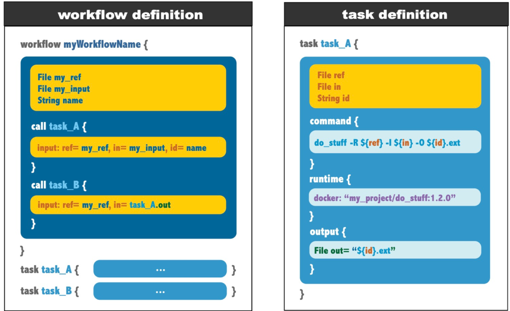
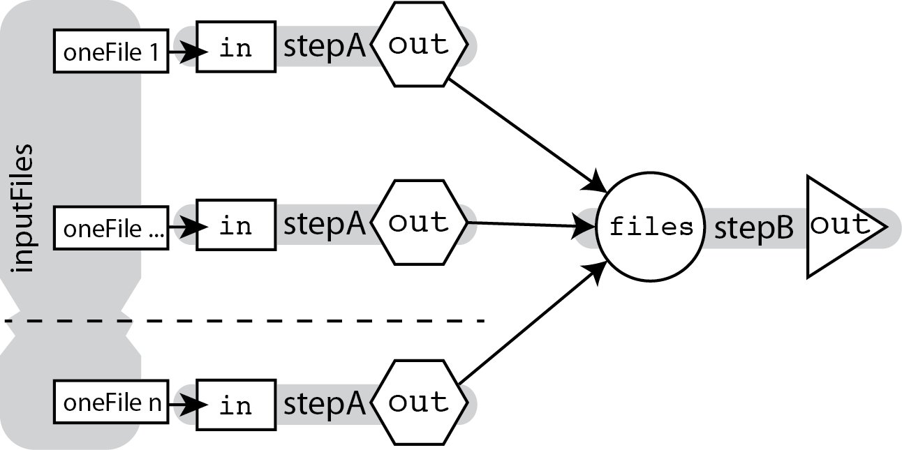
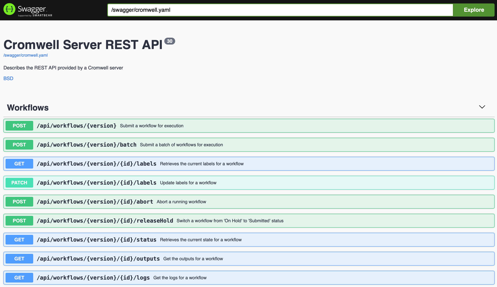

## 1. WDL

WDL全称是Workflow Description Language，是Broad Institute开发的'定义组织任务与工作流的一种语言，主要面向生物信息、基因组学等领域。

### 1.1 WDL概览


WDL有6个基本元件：
- `task`：定义一个任务，即读取输入文件，执行相应命令，然后输出
- `command`：对应task所需执行的linux命令行
- `output`：用于指定task/workflow的输出文件/变量值
- `runtime`：task在计算节点上的运行时的参数，包括CPU、内存、镜像等
- `workflow`：表示一个工作流，由一个或多个task构成，通过call调用对应的task
- `call`：应用于workflow中，用于调用相应的task

**版本**
- [Draft-2](https://github.com/openwdl/wdl/blob/main/versions/draft-2/SPEC.md#alternative-heredoc-syntax)  (目前的主流)
- [1.0](https://github.com/openwdl/wdl/blob/main/versions/1.0/SPEC.md#command-section)
- [1.1](https://github.com/openwdl/wdl/blob/main/versions/1.1/SPEC.md)
- [developyment](https://github.com/openwdl/wdl/blob/main/versions/development/SPEC.md)
[Differences Between WDL Versions](https://github.com/openwdl/wdl/blob/main/versions/Differences.md)

### 1.2 WDL语法

**变量**

变量的声明格式为`Type（？+） name=value`，value可以不存在，由外部传入。
其中Type的类型有String、Int、Float、Boolean、File、Array、Pair、Map，以及自定义的Struct类型。
?表示变量可不用传入信息，+只能跟在Aarry后面，表示数组至少有一个元素。
当定义为File类型时，会自动检查文件是否存在，不存在会报错。
```s
Int? i                     # An integer value, i is optional
Float f = 27.3             # A floating point number
Boolean b = true           # A boolean true/false
String s = "hello, world"  # A string value
File f = "path/to/file"    # A file
Array[Int] a1
```

**runtime**

配置task的运行环境，一般有cpu，memory,docker等。根据不同的任务和运行平台进行设置，也可以是变量，由外部来导入。

一个简单的GATK HaplotypeCaller流程
```s
workflow helloHaplotypeCaller {
  call haplotypeCaller
}

task haplotypeCaller {
  File GATK
  File RefFasta
  File RefIndex
  File RefDict
  String sampleName
  File inputBAM
  File bamIndex
  command {
    java -jar ${GATK} \
        -T HaplotypeCaller \
        -R ${RefFasta} \
        -I ${inputBAM} \
        -o ${sampleName}.raw.indels.snps.vcf
  }
  output {
    File rawVCF = "${sampleName}.raw.indels.snps.vcf"
  }
}
```

多个task之间存在多种依赖关系：
- 一对一
- 一对多
- 多对多
- 平行（多对一）

依赖关系可以通过workflow中的input 指定，例如stepB的变量in 依赖于stepA的输出out，则使用call stepB { input: in=stepA.out }来指定：

```s
workflow BranchAndMerge {
    File firstInput
    call stepA { input: in=firstInput }
    call stepB { input: in=stepA.out }
    call stepC { input: in=stepA.out }
    call stepD { input: in1=stepC.out, in2=stepB.out }
}

task stepA {
    File in
    command { programA I=${in} O=outputA.ext }
    output { File out = "outputA.ext" }
}

task stepB {
    File in
    command { programB I=${in} O=outputB.ext }
    output { File out = "outputB.ext" }
}

task stepC {
    File in
    command { programC I=${in} O=outputC.ext }
    output { File out = "outputC.ext" }
}

task stepD {
    File in1
    File in2
    command { programD I1=${in1} I2=${in2} O=outputD.ext }
    output { File out = "outputD.ext" }
}
```

Task的并行可以通过scatter实现，返回的结果是一个Array[File]类型，对应多个并行任务的结果列表。
```s
workflow ScatterGather {
    Array[File] inputFiles
    scatter (oneFile in inputFiles) {
        call stepA { input: in=oneFile }
    }
    call stepB { input: files=stepA.out }
}

task stepA {
    File in
    command { programA I=${in} O=outputA.ext }
    output { File out = "outputA.ext" }
}

task stepB {
    Array[File] files
    command { programB I=${files} O=outputB.ext }
    output { File out = "outputB.ext" }
}
```




## 2. Cromwell & Womtools
Cromwell是WDL语言的任务管理引擎。Cromwell支持`WDL Draft-2`、`WDL 1.0`、`CWL 1.0`语法，首选`WDL Draft-2`。

### 2.1 安装Cromwell
```bash
# 推荐使用conda安装
conda install cromwell womtools

# 官网下载也可搭配alias食用
alias womtool="java -jar womtool-XX.jar"
alias cromwell="java -Dconfig.file=test.config cromwell-XX.jar"
```
### 2.2 Run模式
cromwell主要有`run`和`server`两个模式。 
`run`模式执行单个任务流程，执行完成即返回；适用于快速运行和调试。
`server`模式，可以将cromwell作为web服务器，无需任何参数即可启动，随后以网页API的模式（/api/RESTAPI）提交需要执行的任务。

**重要参数介绍**
- `workflow-source` 单个wdl文件，可以是本地文件，也可以是URL文件路径
- `--inputs` wdl文件对应的变量输入文件，json格式
- `--imports` zip压缩文件，包含wdl文件中被import的wdl文件
- `--metadata-output` 将写入meta json数据写入文件，例如起始时间、状态及输入、输出参数、执行命令
- `--options` 流程配置文件，分全局配置文件与后端（SGE、SLURM、K8S等作业管理系统）配置文件


**检查和运行WDL脚本**
- `womtools validate` workflow.wdl #检查WDL是否有语法错误
- `womtools inputs` workflow.wdl #输出流程需要的输入参数input.json
- `cromwell run` workflow.wdl -i <input.json> #运行workflow

**配置文件**

`java -Dconfig.file=cromwell.conf -jar cromwell.jar run pipeline.wdl -i pipeline.json -o config.json`

通过[cromwell.conf](https://cromwell.readthedocs.io/en/stable/Configuring/)全局配置文件对cromwell的缓存、流程日志、文件系统、数据库进行个性化设置。可选参数比较多，可以下载[模板](https://github.com/broadinstitute/cromwell/blob/develop/cromwell.example.backends/cromwell.examples.conf)在此基础上修改。

通过[config.json](https://cromwell.readthedocs.io/en/stable/wf_options/Overview/)流程配置文件设置单独的参数。

对于import了其他wdl文件的WDL脚本，建议做法是**将需要import的wdl文件压缩到一个zip**里面，然后使用cromwell中的import命令导入：

`java -Dconfig.file=cromwell.conf -jar cromwell.jar run pipeline.wdl -i pipeline.json -o config.json --imports resource.zip`

**运行目录结构**
```
cromwell-executions/
└── myWorkflow  #WDL流程中的workflow名
    └── 08dd17f4-87c4-4dec-8407-86cab530e775 #本次运行随机生成的workflow ID
        └── call-myTask  #WDL流程中的task
            ├── execution
            │   ├── rc
            │   ├── script
            │   ├── script.background
            │   ├── script.submit
            │   ├── stderr
            │   ├── stderr.background
            │   ├── stdout
            │   └── stdout.background
            ├── input
            └── tmp.0dd09766
```

### 2.3 Server模式
cromwell除了执行单个任务流程的run模式，还有强大的server模式，即启动一个web服务，通过接收API请求实现任务调度。
优点：
- 可以并行处理多个workflow，适用于生产环境
- 有Call caching等高级特性，优化workflow的执行
- 提供丰富的workflow metadata，来展示workflow的执行过程

#### 2.3.1 Web Server服务器端
`java -Dconfig.file=cromwell.config -jar cromwell.jar server`
cromwell默认开启8000端口，可以在cromwell.config中修改网络配置，浏览器打开`http://localhost:8000`



页面提供了很多对任务（流程）的提交、查询、统计等API，可以在网页中直接点击提交，也可以使用`curl/wget` 等命令行进行处理。

很多组织对这些API进行了进一步的封装，比较流行的是cromshell、cromwell-tools、oliver。

#### 2.3.2 Client客户端
`REST API`直接使用Python访问Server提供的API接口。
`cromshell`[](https://github.com/broadinstitute/cromshell) 由broad开发，实质是基于`curl`的shell脚本做的进一步封装。

[cromwell-tools](https://github.com/broadinstitute/cromwell-tools), 也是由broad开发，实质是基于python对API的进一步封装。

使用示例：

```bash
cromshell submit workflow.wdl inputs.json options.json dependencies.zip
cromshell status
cromshell -t 20 metadata
cromshell logs -2
```

[oliver](https://github.com/stjudecloud/oliver) 是St. Jude Children's Research Hospital基于python开发的cromwell工具。

oliver特点：
- Workflow Orchestration. Easily submit, inspect, kill, and retry workflows in a Cromwell environment.
- Better Job Tracking. Jobs can be associated with names and job groups to enable better status reporting.
- Dynamic Argument Parsing. Specify inputs and options on the command line rather than editing JSON files.
- Third-party Cloud Integrations. Use the aws and azure subcommands to explore cloud-specific functionality.


## 3. Cromwell进阶
### 3.1 配置集群任务投递

cromwell不仅支持本地计算机任务调度，同时支持[HPC集群任务调度系统](https://cromwell.readthedocs.io/en/stable/backends/HPC/)，只需要进行简单配置，就可以实现大规模计算。
官方针对不同的集群调度系统提供了相关的[配置文件]（https://github.com/broadinstitute/cromwell/tree/develop/cromwell.example.backends），其本质都是将调度命令嵌入其中，下面以常用的SGE作业调度系统为例进行介绍。


```conf
# This is an example of how you can use the the Sungrid Engine backend
# for Cromwell. *This is not a complete configuration file!* The
# content here should be copy pasted into the backend -> providers section
# of cromwell.example.backends/cromwell.examples.conf in the root of the repository.
# You should uncomment lines that you want to define, and read carefully to customize
# the file. If you have any questions, please open an issue at
# https://www.github.com/broadinstitute/cromwell/issues

# Documentation:
# https://cromwell.readthedocs.io/en/stable/backends/SGE

backend {
# 选择默认的providers， 名字需要与 providers 内部的名字一致
  default = SGE

  providers {
  # 配置SGE providers 
    SGE {

   # 所有调度系统都是在该配置文件的基础上进行
      actor-factory = "cromwell.backend.impl.sfs.config.ConfigBackendLifecycleActorFactory"
      # 具体的配置文件
      config {

        # Limits the number of concurrent jobs， 主要针对cromwell server 设计
        concurrent-job-limit = 5

        # 多长时间检查（check-alive）一次任务状态，默认是120s
        exit-code-timeout-seconds = 120

        # 运行环境的属性， 需要与 task/workflow 中的 `runtime` 模块属性 以及下面的submit命令中的变量一致
        # 可以在这里指定 cpu/memory/sge_queue/sge_project的默认参数
        runtime-attributes = """
        Int cpu = 1 
        Float? memory_gb
        String? sge_queue
        String? sge_project
        """

        # submit/kill/check-alive 对调度系统中对应命令进行封装，将cromwell变量嵌入其中
        # submit 命令中提到的 jobs_name, cwd, out, err, jobs_id 均为cromwell内置变量
        # 其他变量需要提前在 runtime-attributes 中声明

        submit = """
        qsub \
        -terse \
        -V \
        -b y \
        -N ${job_name} \
        -wd ${cwd} \
        -o ${out}.qsub \
        -e ${err}.qsub \
        -pe smp ${cpu} \
        ${"-l mem_free=" + memory_gb + "g"} \
        ${"-q " + sge_queue} \
        ${"-P " + sge_project} \
        /usr/bin/env bash ${script}
        """

        kill = "qdel ${job_id}"
        check-alive = "qstat -j ${job_id}"
        job-id-regex = "(\\d+)"
      }
    }
  }
}
```

### 3.2 配置容器
以Docker为例

```conf
dockerRoot=/cromwell-executions
backend {
  default = Docker

  providers {

    # Example backend that _only_ runs workflows that specify docker for every command.
    Docker {
      actor-factory = "cromwell.backend.impl.sfs.config.ConfigBackendLifecycleActorFactory"
      config {
        run-in-background = true
        runtime-attributes = "String docker"
        # 嵌入 docker 的运行命令
        # docker_cwd 通过 dockerRoot（默认 /cromwell-executions） 设置, 与当前目录（${cwd}）下 ./cromwell-executions 相对应
        submit-docker = "docker run --rm -v ${cwd}:${docker_cwd} -i ${docker} /bin/bash < ${docker_script}"
      }
    }
  }
}
```

### 3.3 SGE+Docker联动

SGE + Docker 可能是目前生物信息学分析过程中常见的组合配置，但是官方仅有单独的SGE配置，单独的docker配置，并没有SGE+docker的配置。

```conf
# cromwell.sge.docker.config
# 完整配置文件
include required(classpath("application"))

backend {
  default = SGE_Docker

  providers {
    SGE_Docker {
      actor-factory = "cromwell.backend.impl.sfs.config.ConfigBackendLifecycleActorFactory"
      config {

        # Limits the number of concurrent jobs
        concurrent-job-limit = 500

        # If an 'exit-code-timeout-seconds' value is specified:
        # - check-alive will be run at this interval for every job
        # - if a job is found to be not alive, and no RC file appears after this interval
        # - Then it will be marked as Failed.
        # Warning: If set, Cromwell will run 'check-alive' for every job at this interval

        # exit-code-timeout-seconds = 120

        # `script-epilogue` configures a shell command to run after the execution of every command block.
        #
        # If this value is not set explicitly, the default value is `sync`, equivalent to:
        # script-epilogue = "sync"
        #
        # To turn off the default `sync` behavior set this value to an empty string:
        # script-epilogue = ""

        script-epilogue = "sync && sleep 8 "

        # 运行环境的属性， 需要与 task/workflow 中的 `runtime` 模块属性 以及 本文submit 命令中的变量 一致
        # 同时说明，可以通过修改配置文件，任意修改 task/workflow 中的 `runtime` 模块属性 满足个性化需求
        runtime-attributes = """
        String docker
        String? root = '/'
        Int? cpu = 1
        Int? memory_gb = 2
        String? sge_queue
        """

        # submit/kill/check-alive 对调度系统中对应命令进行封装，将cromwell变量嵌入其中
        # submit 命令中提到的 jobs_name, cwd, out, err, jobs_id 均为cromwell内置变量
        # 其他变量需要提前在 runtime-attributes 中声明
        submit-docker  = """
        qsub \
        -terse \
        -V \
        -b y \
        -N ${job_name} \
        -wd ${cwd} \
        -o ${out}.qsub \
        -e ${err}.qsub \
        -l vf=${memory_gb}G \
        ${"-pe smp " + cpu} \
        ${"-q " + sge_queue} \
        docker run --rm  --user $(id -u):$(id -g) -a STDERR -v ${root}:${root} ${docker}  /usr/bin/env bash ${docker_script}
        """
        # docker 运行变量，本身是有 -v ${cwd}:${docker_cwd} 的文件夹映射
        # docker_cwd 通过 dockerRoot（默认 /cromwell-executions） 设置, 与当前目录（${cwd}）下 ./cromwell-executions 相对应
        # 这时候比较麻烦的就是，如果你有以绝对路径表示的输出文件，那么docker容器内部的路径名与外部路径不一致，就会造成混乱
        # 所以，这里的解决方案是去掉-v ${cwd}:${docker_cwd} , 引入root变量，把docker容器内部、外部的路径打通，方便文件读取、写入
        # 需要注意的是，root的目录的层级，很明显根目录/ 最简单，但是权限很高，风险也就高 

        kill = "qdel ${job_id}"
        check-alive = "qstat -j ${job_id}"
        job-id-regex = "(\\d+)"

        kill-docker = "qdel ${job_id}"
        check-alive-docker = "qstat -j ${job_id}"
        job-id-regex-docker = "(\\d+)"
      }
    }
}
}
docker.hash-lookup.enabled = false
```

将上述文件cromwell.sge.docker.config作为参数输入，即可使用cromwell调度sge+docker

`java -Dconfig.file=cromwell.sge.docker.config cromwell.jar run ...`

**注意：** 如果计算节点没有docker image， cromwell 可以自动pull, 如果docker hub 也没有，需要手动 docker build 

### 3.4 其他调度系统配置文件

#### Cloud Providers

- AWS(AWS.conf): [Amazon Web Services](https://cromwell.readthedocs.io/en/stable/tutorials/AwsBatch101/)
- BCS(BCS.conf) [Alibaba Cloud Batch Compute (BCS) backend](https://cromwell.readthedocs.io/en/stable/backends/BCS/)
- TES(TES.conf) [GA4GH server backend](https://cromwell.readthedocs.io/en/stable/backends/TES/)
- PAPIv2(PAPIv2.conf): [Google Pipelines API backend](https://cromwell.readthedocs.io/en/stable/backends/Google/)

#### Containers

- Docker(Docker.conf): an example backend that only runs workflows with docker in every command
- Singularity(singularity.conf): run Singularity containers locally (documentation)
- Singularity+Slurm(singularity.slurm.conf): An example using Singularity with SLURM (documentation)
- TESK(TESK.conf) is the same, but intended for Kubernetes. See the TES docs at the bottom.
- udocker(udocker.conf): to interact with udocker locally documentation
- udocker+Slurm(udocker.slurm.conf): to interact with udocker on SLURM (documentation)

#### Workflow Managers

- [HtCondor](https://cromwell.readthedocs.io/en/stable/backends/HTcondor/): a workload manager at UW-Madison
- [LSF](https://cromwell.readthedocs.io/en/stable/backends/LSF/): the Platform Load Sharing Facility backend
- [SGE](https://cromwell.readthedocs.io/en/stable/backends/SGE): a backend for Sungrid Engine 
- [slurm](https://cromwell.readthedocs.io/en/stable/backends/SLURM/): SLURM workload manager 


**参考资料**
- https://cromwell.readthedocs.io
- https://biowdl.github.io/
- https://zhuanlan.zhihu.com/p/417633670
- https://support.terra.bio/hc/en-us/sections/360007274612-WDLs-Resources
- http://jackywu.site/technology/Cromwell引擎分析/