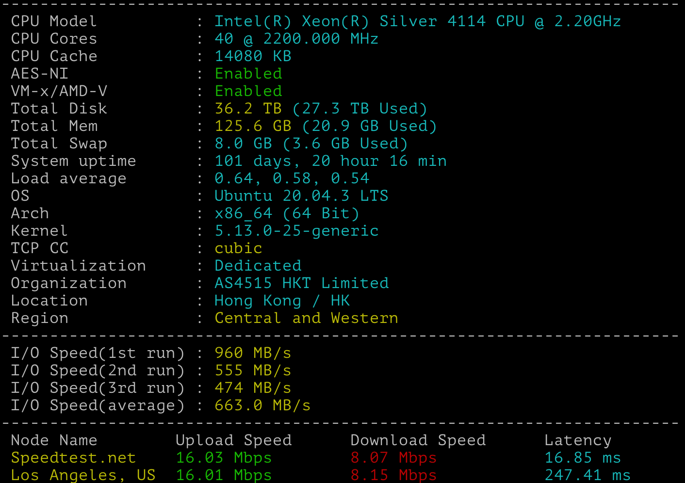

# Linux服务器性能测试


## bench.sh 一键脚本

经过几个版本的演化，一键测试脚本 bench.sh 已经几乎全面适用于各种 Linux 发行版的网络（下行）和 IO 测试。
并将测试结果以较为美观的方式显示出来。

`bench.sh` 特点：
- 显示当前测试的各种系统信息；
- 取自世界多处的知名数据中心的测试点，下载测试比较全面；
- 支持 IPv6 下载测速；
- IO 测试三次，并显示平均值。

使用方法:
```bash
#直接在线使用
wget -qO- bench.sh | bash #-qO-最后的`-`表示写入内存不保存文件
curl -Lso- bench.sh | bash
#注：bench.sh 既是脚本名，同时又是域名，所以可以这样简写

#下载之后本地随时使用
wget https://github.com/teddysun/across/raw/master/bench.sh
chmod +x bench.sh
./bench.sh
```

我在一台本地服务器上运行结果如下： 




## UnixBench 一键脚本
UnixBench是一个类unix系（Unix，BSD，Linux）统下的性能测试工具，一个开源工具，被广泛用与测试linux系统主机的性能。Unixbench的主要测试项目有：系统调用、读写、进程、图形化测试、2D、3D、管道、运算、C库等系统基准性能提供测试数据。

- UnixBench目前只支持`centos`、`debian`、`ubuntu` 三种Linux系统...
- UnixBench需要root权限，所以需要切换到root用户或者使用sudo。
- UnixBench大概需要运行10-30分钟（根据CPU内核数量，运算时间不等）得出分数，越高越好。

使用方法:
```bash
wget https://github.com/teddysun/across/raw/master/unixbench.sh
chmod +x unixbench.sh
./unixbench.sh
```


>如果要测试graphic，则需要修改Makefile，开启”GRAPHIC_TESTS = defined”，同时需要系统提供x11perf命令gl_glibs库。不过大多数Linux服务器都是没有显卡或者是集显，所以图像性能无需测试。

## sysbench 
sysbench是一个模块化的、跨平台、多线程基准测试工具，主要用于评估测试各种不同系统参数下的`数据库`负载情况。
sysbench支持以下几种测试模式：
>1、fileio   磁盘IO性能
>2、cpu      CPU运算性能
>3、memory   内存分配及传输速度
>4、threads  线程子系统性能测试
>5、mutex    互斥性能测试
>6、oltp     数据库性能(OLTP在线事务处理测试)
>目前sysbench主要支持 mysql,drizzle,pgsql,oracle 等几种数据库。

```bash
#安装
emerge -av sysbench #gentoo

#简单使用
sysbench --test=fileio --file-test-mode=seqwr run
```

更多内容查看[sysbench使用教程](http://ghoulich.xninja.org/2016/05/11/sysbench-manual/)

扩展阅读：[一键脚本那些事儿](https://teddysun.com/451.html)
